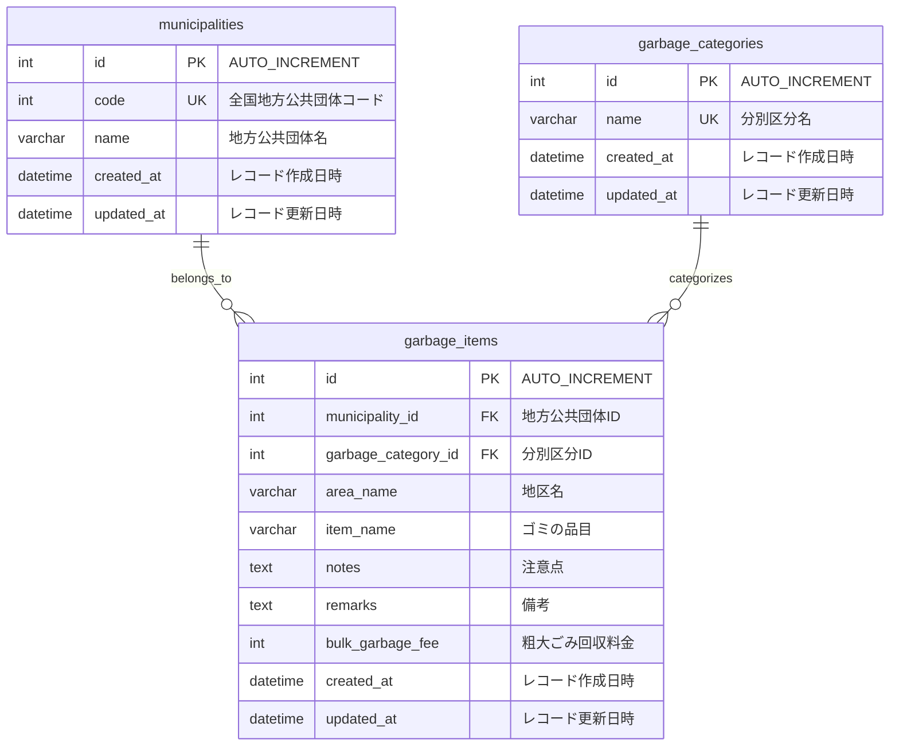

## 要件

自治体のゴミの分類をクイズとして出す

## データ要件

- 東京都のデータセットを使用
  - 【板橋区】ゴミ分別のデータです。
    - https://service.api.metro.tokyo.lg.jp/api/t131199d3000000001-10af70080e2503877feb2bf2c9a42171-0/json

## 画面要件

- TOP画面
  - クイズを始める画面
- クイズを出す画面
    - ランダムで5問
      - 4択問題
- 答えを出す画面
  - 注意事項と粗大ゴミの料金を出す
  - 次へボタン
  - 終了ボタン

## 設計

### データ取得

ECSのスケジュールされたタスクでcron形式で実行する

### クイズの設計

- 4択問題の仕組み
  - 以下のゴミ分別カテゴリから正解の選択肢 + 3つをランダム表示
    - 可燃
    - 不燃
    - 資源
    - 粗大
    - 有害ごみ
    - 容器包装プラスチック
    - 製品プラスチック
    - 古布
    - 新聞・折込チラシ
    - 雑誌・本・雑がみ
    - 段ボール・茶色紙
    - 牛乳等紙パック
    - 缶
    - びん
    - ペットボトル
    - 燃やせるごみ
    - 燃やせないごみ
    - 粗大ごみ
    - 拠点
    - 不可
    - 処理困難物【市での収集は不可】
    - パソコン【市での収集は不可】
    - 家電リサイクル法対象品【市での収集は不可】

- 正解表示画面の内容
  - 正解のカテゴリ名
  - 注記（備考）
  - 粗大ゴミの場合は料金を表示

### 技術選定

### バックエンド

- Go
  - Gin
  - slog
  - go-migrator
  - gorm
  - golangci-lint
  - swag

### フロントエンド

- React

### インフラ

- Docker
  - MySQL (ローカル)
  - Go (Lambda用)
- CI/CD
    - GitHub Actions
- AWS
  - Amplify
  - Lambda
    - サーバーの置き場所
  - RDS
    - MySQL

## DB設計

