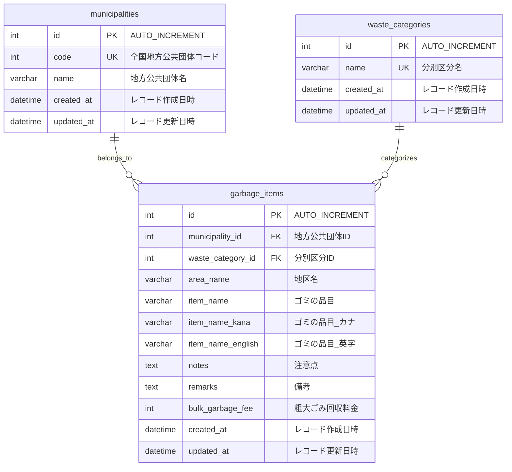

## 要件

ユーザーがゴミを選択して、分類方法の差分を出力するアプリケーション

## データ要件

- 東京都のデータセットを使用
  - 【板橋区】ゴミ分別のデータです。
    - https://service.api.metro.tokyo.lg.jp/api/t131199d3000000001-10af70080e2503877feb2bf2c9a42171-0/json
  - 【立川市】ごみの分別方法一覧
    - https://service.api.metro.tokyo.lg.jp/api/t132021d3000000001-ef24963d14f44ffddea8de17cb2d0ea6-0/json

## 画面要件

- 入力画面
  - ユーザーが自治体を入力する
  - ユーザーがセレクトボックスからゴミを選択する
- 検索結果画面
  - ユーザーが検索した結果を返す画面

## 設計

### データ取得

1. ECSのスケジュールされたタスクでcron形式で実行する

### データ処理

- 入力値

板橋、立川市、ゴミの名前

- 出力値

ゴミの分類方法

### 技術選定

### バックエンド

- Go
  - Gin
  - slog
  - go-migrator
  - gorm or sqlc
  - golangci-lint
  - swag

### フロントエンド

- React

### インフラ

- Docker
  - MySQL (ローカル)
  - Go (Lambda用)
- CI/CD
    - GitHub Actions
- AWS
  - Amplify
  - Lambda
    - サーバーの置き場所
  - RDS
    - MySQL

## DB設計

